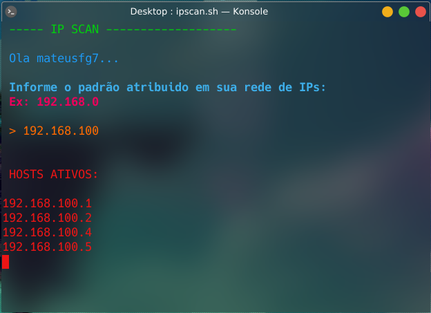

# Ip Scan
***Script feito em shell para poder escanear os IPs ativos em sua rede local***

> *Testado apenas no Debian*

Dê permissões de execução:
```
$ sudo chmod +x ipscan.sh
```
Execute:
```
$ ./ipscan.sh
```

Preview 